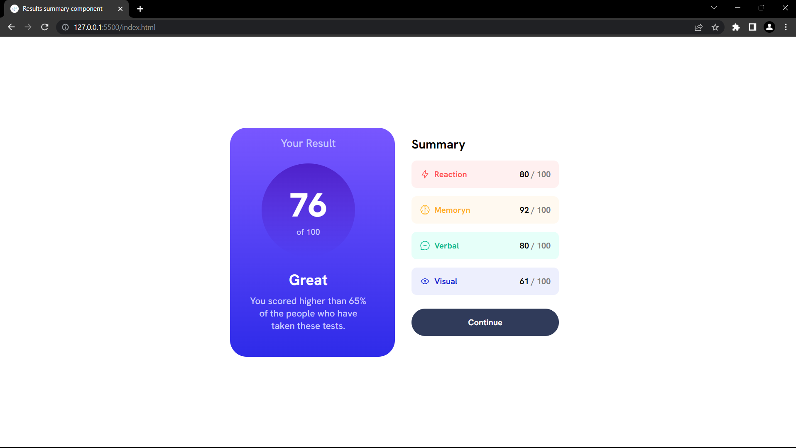

# Frontend Mentor - Results summary component

This is a solution to the [Results summary component challenge on Frontend Mentor](https://www.frontendmentor.io/challenges/results-summary-component-CE_K6s0maV).

## Table of contents

- [Overview](#overview)
  - [Screenshot](#screenshot)
  - [Links](#links)
- [My process](#my-process)
  - [Built with](#built-with)
  - [What I learned](#what-i-learned)
  - [Useful resources](#useful-resources)
- [Author](#author)

## Overview

### The challenge

Users should be able to:

- View the optimal layout for the interface depending on their device's screen size
- See hover and focus states for all interactive elements on the page

### Screenshot

### Links

- Solution URL:  https://github.com/TJ-Shubham/results-summary-component
- Live Site URL: https://tj-shubham.github.io/results-summary-component/

## My process

### Built with

- Semantic HTML5 markup
- CSS custom properties
- Flexbox
- Used media query

### What I learned

Learn background properties. Understand the Opacity & box shadow properties.

### Useful resources

- [gradient](https://css-tricks.com/css3-gradients/) - This helped me for background gradients properties. I really liked this pattern and will use it going forward.

## Author

- Website - [Shubham](https://github.com/TJ-Shubham)

